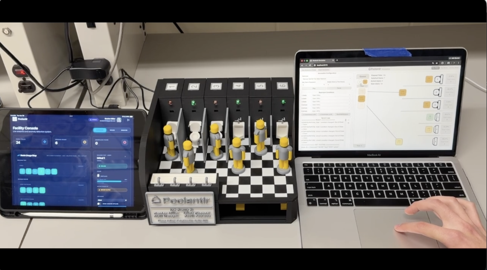

# poolantir-toilet-simulation

    
    

  
<strong>3D Model (Left) & Digital Twin (Right)</strong>

### Description
Proof-of-Concept of simply adding a data layer to bathrooms to track usage, using ML to detect restroom anomalies to optimize janitorial scheduling and improve restroom conditions.

---

### Repository Tags

  
  
  
  
  
  
  
  
  
  
  
  
  

---

## Project Idea

This project is a non-invasive proof-of-concept that demonstrates
how adding a layer of data analysis to existing self-flush toilets can
optimize maintenance schedules and automate incident reports,
thereby promoting cleaner restrooms. Data is collected using a 3D
simulation; This is not a marketable solution. 

There are two goals:
- optimize janitorial schedules by detecting anomalies using ML --> improve restroom cleanliness
- give restroom users the information necessary to make correct restroom guesses so they do not have to wait --> improve user experience

We are simply using data to build a historical usage model of restrooms which ML model will use to 
detect anomalies. Here is a situation of an anomly at popular bathroom with 3 urinals over a one hour timeframe:

Historical Data (30 minutes, 50 uses):
- Urinal_1 used ~30%; 15 uses
- Urinal_2 used ~2%; 1 use
- Urinal_3 used ~68%; 34 uses 

Actual Data (30 minutes, 30 uses):
- Urinal_1 used ~60%; 18 uses (+30% change)
- Urinal_2 used ~33%; 10 uses (+31% change)
- Urinal_3 used ~6.7%; 2 uses (-61.3% change)

An ML model with sufficient historical data would be able to infer an anomaly at Urinal_3, which is historically the 
most used toilet, but currently the least used.

Additionally, historical usage and current trends can be used to inform users of optimal toilet to use. For example, if you
are tailgating at the University of Iowa library on a football game day, there are two locations you can go to use the restroom: 
- porta-potties (10-100 steps)
- library bathroom (a few hundred steps)

For example, if the porta-potties are extremely busy, you will spend more time waiting in line than it would take to walk a bit further to the library to use a 
restroom. This is a small anecdotal example, but the same idea applies to highly congested areas: airports, campuses, stadiums, etc. Think about if you get off a flight, have a short 
layover and are expected to board in 5 minutes. There may be multiple bathrooms you could use, but which is the best? A simple system like this would work wonders.

Ultimately, using the restroom is a sacred time and one that is not to be meddled with. In my honest opinion, there are few letdowns worse than really needing to use a toilet, only to 
walk into a restroom to find that they are all full.

## System Architecture
This project created a star network of ESP32 bathroom nodes to monitor whether or not a user has entered the range of the ToF sensor (meaning someone is using the toilet). This information is collected via a gateway device (macbook for our project) and transmitted to a Firebase Database to log historical toilet uses. This information is then used downstream within our mobile application and ML model. 

I was responsible for the simulation of the 

  
  
<strong>Project Architecture</strong>

## Project Images

    
    
    
    
    
    
    
    

## Project Demo

  
  
<strong>Click the image above to view the <a href="img/Poolanitr_Demo.mp4">Demo Video</a> (the .mp4 file is too large to display here)</strong>

## My Contributions
I was in charge of the project planning and simulation of data. I did not touch any of the ML / Data layer.

**Project Contributions:**
- 100% Idea, Project Architecture, and Planning
- 100% CAD Modeling, 3D Printing, and Project Assembly
- 100% Simulation Controller Software
- 100% Hardware Selection, PCB, and Microcontroller Software
- 75% Project Slidedeck (Abstract, Hardware, and Simulation sections) 
- 75% Project Poster (Abstract, Hardware, and Simulation sections)
- 0% Firebase Backend
- 0% Mobile Application
- 0% ML Detection Software

This project spanned three school weeks in which I spent ~150 total hours. The majority of the time was spent
working on the CAD model and 3D printing. Getting the glide perfect took many iterations of 
the diorama top/bottom frames and rack-and-pinion - plus a little bit of vasolene to remove the crunching noise. Wiring and soldering 
also took a large chunk of my time as there were six identical nodes to be soldered and custom adapters for my servo rails. 
About ~20 hours was spent agentically developing the frontend (simulation digital twin), backend (simulation behavioral model backend), and
the ESP32 nodes. Thankfully, I finished on time and hit all of my requirements which I set out to achieve. Given more time, I would make necessary 
changes to the software simulation portion of the project, writing it in C++. This would allow for better OOP modeling of the behavioral model and the use
of OpenMP to better simulated human behavior. A few all-nighters were pulled and many classes were skipped.

## Project Outcomes

Selected to present the project alongside Senior Design and other cool projects at the Uiowa ECE Modern Marvels event. 

  
  

<strong>Project Showcase</strong>

